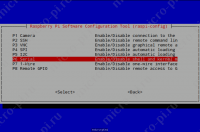

# Настройка UART

Репозиторий WirinPi(зеркало)
	
		https://github.com/WiringPi/WiringPi

## 	Настройка Serial Port

Настройка UART на Raspberry Pi
По умолчанию последовательный порт на Raspberry Pi настроен как консольный порт для связи с ОС Linux. Если вы хотите использовать этот последовательный порт, вы должны отключить ОС от использования этого порта.

В Raspberry Pi введите следующую команду в окне терминала, чтобы включить UART и отключить консоль на последовательный порт,
		
		sudo raspi-config
		
* <b>Выберите «Interfacing Options»</b>

* <b>После «Interfacing Options» выберите «Serial», чтобы включить UART</b>

* <b>Затем выберите «No», чтобы отключить консоль на последовательный порт</b>

* <b>В конце попросит включить аппаратный последовательный порт, выберите «Да»</b>

* <b>Всё, UART включен, консоль отключена</b>

## UART и дерево устройств

Различные определения оверлея в дереве устройств UART можно найти в дереве ядра GitHub . Два самых полезных оверлея - это <em>disable-bt</em> и <em>miniuart-bt</em>.

<em>disable-bt</em> отключает устройство Bluetooth и делает первый PL011 (UART0) основным UART. Вы также должны отключить системную службу, которая инициализирует модем, чтобы он не подключался к UART, используя 

		sudo systemctl disable hciuart.

<em>miniuart-bt</em> переключает функцию Bluetooth на использование мини-UART и делает первый PL011 (UART0) первичным UART. Обратите внимание, что это может снизить максимально используемую скорость передачи данных (см. Ограничения мини-UART ниже). Вы также должны установить тактовую частоту ядра VPU на фиксированную частоту с помощью <em>force_turbo=1</em> или <em>core_freq=250</em>.

В таких надписях <em>uart2</em>, <em>uart3</em>, <em>uart4</em> и <em>uart5</em> используются для того, чтобы четыре дополнительных UARTs на Pi 4. Существует и другие UART-специфические накладки в папке. См. <em>/boot/overlays/README</em> Подробные сведения о наложениях дерева устройств или запустите <em>dtoverlay -h overlay-name</em> для получения описаний и информации об использовании.

Полные инструкции по использованию наложений дерева устройств см. На этой странице . Вкратце, добавьте строку в <em>config.</em> файл, чтобы применить наложение дерева устройств. Обратите внимание, что <em>-overlay.dts</em> часть имени файла удалена. Например:

		dtoverlay=disable-bt